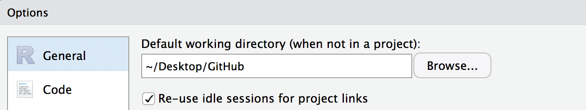

```{r, include=FALSE}
knitr::opts_chunk$set(echo = TRUE, error = TRUE)
```

> "PC load letter! What the fuck does that mean?"  
> *- Michael Bolton, Office Space*

If you've ever written code, you've also probably spent (easily) twice as much time trying to figure out why it doesn't work. Maybe you forgot a bracket? Maybe you used the wrong file path? Maybe your code runs just fine, except your model now predicts the global population will stabilize at 90 billion people and you're seeing some pesky warning message about vectors of different lengths. Whatever the reason, you *will* find yourself searching for the gremlin in your code and hoping it doesn't take you three full work hours (days?) to solve the problem. This post is designed to provide a broad overview of the concepts, tools, tips, and tricks you can use to track down problems in your `R` code and become a trophy winning Big Game Gremlin Hunter.    

## General Concepts
Before diving into common errors and available debugging tools for R, let's review a few general programming concepts that are often the culprits behind many errors. 

### Working Directory & File Paths
When working in R, we often need to *read* in a dataset and save subsequent results and figures by *writing* them to the hard drive. Both of these operations require specifying a file **path**, which refers to a file's unique location in a file system and can be thought of as the file's address on your computer. There are two options for specifying a file's path - the **absolute** and **relative** paths - which differ in whether or not they depend on the current **working directory**. Returning to our address analogy, the working directory refers to the folder (directory) that R considers to be the home address for whatever analysis you're working on. 

R will look for (and save) files to the working directory folder unless told otherwise. Keeping all your files in a single directory can be messy, however, and so we can tell R to read/write data to/from different folders using absolute or relative paths:  
  
  + **Absolute or "full" paths** point to the same location, regardless of the current working directory 
    + e.g., the absolute path for the `.Rmd` file for this tutorial is located
    at `/Users/Tyler-SFG/Desktop/GitHub/deBug/deBug.Rmd` on my computer
  + **Relative paths** point to the file's location *relative* to the current working directory
    + e.g., because my working directory is `/Users/Tyler-SFG/Desktop/GitHub/deBug/`, the relative path for the same `.Rmd` file is just `deBug.Rmd`

It is generally a good idea to use relative paths for the purposes of making your work reproducible and easy to collaborate on. Consider two users (or even one user with two computers) attempting to collaborate on a GitHub repository they have each cloned to their computers. Absolute paths will not work properly since they will be different for each computer while relative paths will remain valid. This assumes that all users have specified the same working directory, such as `deBug/` in the above example. 

You can determine your current working directory with `getwd()` and can tell R to use a different working directory with `setwd('path/to/new/working/directory')`. To set a default working directory for your R scripts go to `RStudio -> Preferences -> General`:

```{r, echo=FALSE}

```

You may be tempted to start each R script by specifying the desired working directory with `setwd()`. **Don't!** This approach can have the same issues with reproducibility/collaboration as absolute paths and, besides, there's a better way!

#### RStudio Projects
[RStudio Projects](https://support.rstudio.com/hc/en-us/articles/200526207-Using-Projects) are a built-in way to organize all the files associated with a project. There are a lot of advantages to using R Projects that are beyond the scope of this tutorial, so check out the above link to learn more about badassing your RStudio workflow with projects.

### Environments
Environments organize a set of name-value **bindings**. A useful analogy is to think of an environment as a contact list for R objects - the environment contains a list of R objects (the "people") and their associated values (their "numbers"). Understanding environments is critical for debugging code because environments determine what objects (variables, data frames, functions, etc.) are visible to a particular line of code. While a detailed explanation of R environments is beyond the scope of this tutorial, Hadley Wickham (who else?) has [this great tutorial](http://adv-r.had.co.nz/Environments.html) available for anyone interested.

For debugging most R errors, the important environments to understand are the **global** environment (`globalenv()`) - the interactive workspace in which you normally work - and the **current** environment (`environment()`) - the environment containing whatever code is currently being executed. Understanding the difference between these two becomes particularly neccessary when using functions. Every time a function is called, R creates an **execution enviornment**  in which to host execution of that function's code. This environment is a temporary **child** of the global (or parent) environment; it can access objects (bindings) in its parent environment(s) but bindings created within the execution environment will not become visible to the parent environment(s) unless explicitly assigned with the deep assignment arrow, `<<-`. The regular assignment arrow, `<-`, always creates a **local** variable in the current environment while `<<-` either modifies an *existing* variable in the parent environment or creates one in the global environment. The deep assignment arrow will *never* create a variable in the current environment.

Consider the following example, in which a the function `foo()` is used to modify both a local and global variable:

```{r}
# Create global variable
a <- 1
# foo function
foo <- function(x) {
  # create local variable b from global variable a and function argument x
  a <- a + x
  print(a)
}

# Run foo
foo(4)
```

Running `foo(x)` prints a value of `5`. But if check the value of `a` outside of the function we see that it is unchanged:

```{r}
print(a)
```

  
### Syntax vs Semantic Errors
There are two main types of errors in R code:

  1. **Syntax errors** result from invalid code statements that R doesn't understand. Syntax errors will always result in error messages
  2. **Semantic errors** result from valid code that successfully executes but produces unintended outcomes

Not surprisingly, syntax errors can be considerably easier to debug than semantic errors since they provide a (sometimes) useful error message and do not suggest an underlying flaw in methodology/logic. 
  
## Common Errors & Warnings
One thing that R is notorius for is its often cryptic and difficult to decipher error messages. In what can only be described as an act of masochism, Noam Ross investigated the most [common errors in R](https://github.com/noamross/zero-dependency-problems/blob/master/misc/stack-overflow-common-r-errors.md) using data from nearly 20,000 Stack Overflow posts. The results showed that a considerable fraction of problems people have can be attributed to the handful of error types outlined below:

  1. `object not found...` 
The object (variable, data frame, list, function, etc.) being called in the code has not actually been defined: 
```{r}
# Try printing foo
print(foo2)
```

Check spelling and, in the case of objects read from data files, that the file path is correct.

---

  2. `could not find function...`
The function is spelled wrong or the package it belongs to has not been loaded:
```{r}
# Create foo (will fail)
foo <- data_frame(x = c(1:5), y = letters[1:5])
```


```{r, message=FALSE}
# load tidyverse
library(tidyverse)
# Create foo after loading package (will work)
foo <- data_frame(x = c(1:5), y = letters[1:5])
```

---

  3. `Error in if...` 
The logical statement in your `if()` statement is not yielding a logical value (`TRUE`/`FALSE`)
```{r}
if(foo[6,1] > 4) { print('woohoo!')}
```

---

  4. `subscript out of bounds`
Code refers to an index that does not exist:

```{r}
# Matrix
a <- 3
foo <- matrix(NA, nrow = 2, ncol = 2)
foo[a,1] <- 'wtf'
```

**Note:** This error applies to matrices and lists but *NOT* data frames or vectors.

```{r}
# Make foo2 a dataframe instead of a matrix
foo <- data.frame(matrix(NA, nrow = 2, ncol = 2))
# Printing does not give an error, just an NA
foo[a,1]
```

This can result in unintended outcomes that go unnoticed, such as accidentally *creating* the erroneous index in your dataframe:

```{r}
# Assignment will actually CREATE that index in the data frame or vector
foo[a,1] <- 'wtf'
foo
```

---

  5. `...cannot open the connection`
R can't read/write the file, usually due to an incorrect path:
```{r}
write_csv(foo, path = 'the/long/road/to/nowhere.csv')
```

---

  6. `non-numeric argument to binary operator`
Trying to do math with a non-numeric variable, such as when a data frame column is acidentally a character column:
```{r}
a <- '7'
6 + a
```

--- 

  7. `replacement has...` 
Attempting to assign a vector of values to a subset of an existing object where the lengths are different:
```{r}
foo <- data_frame(n = c(1:5), d = letters[1:5])
foo$test <- c(1:10)
```

```{r}
# Replacement is longer
a <- c(30:50)
foo <- c(1:30)
foo[1:10] <- a
```

## Debugging Tools
Time for the (not so) fun stuff - debugging tools. R and RStudio provide a handful of useful built-in tools designed to help you locate an error and investigate the environment state at the time of the error in order to figure out what went wrong. In a nutshell, debugging includes the following steps:

1. Locate the point in the code where the error occurs (syntactic errors) or where you suspect it occurs (semantic errors)
2. Stop the code at that point
3. Examine the code within the context of the current environment

### Step 1: Locate the error with `traceback()`
Before you can fix a bug in your code, you need to find it in the "call stack" - the sequence of function calls that led to the error. 

Consider what happens when we try to run the following function `gizmo()`:

```{r}
# Load script containing several functions
source('gremlins.R')

# Run gizmo
gizmo(samples = 10)
```

We receive a familiar error message but no information about where in the `gizmo()` function the error is located other than that it contains the code snippet `samples * "2"`. Enter `traceback()`, which will print the call stack of the last uncaught error:

```{r, eval=FALSE}
traceback()
```

```{r}
# 2: rnorm(n = samples * "2") at gremlins.R#12
# 1: gizmo(10)
```


Running `traceback()` tells us the the error occurs at `gremlins.R#12`, or line 12 in `gremlins.R`. If you're working in a RMarkdown document or notebook, the error message generated by the faulty code chunk provides a shortcut for running `traceback()`.


We're now ready to open the `gremlins.R` script, navigate to line 12, and figure out what's causing the error (which hopefully should be obvious at this point!). However, in order to accurately fix the error, we need to evaluate it in the context of the execution environment of `gizmo()`. 

### Step 2: Stop the code with breakpoints and `browser()`
In our previous example, the `gizmo()` function is very short and contains only one argument, `samples = 10`. Still, we can't simply open `gremlins.R` and try to edit `gizmo()` because the `samples` variable only exists in `gizmo()`'s execution environment. Resist the temptation to create `samples` in your global environment! Doing so will likely lead to chaos down the line, especially when dealing with more complicated and/or nested functions. Instead, RStudio provides several handy tools for entering the current environment at any point in your workflow!

#### Breakpoints
The easiest way to stop on a given line of code is to create an **editor breakpoint** by clicking to the left of the number in the code editor. The breakpoint will be indicated by a solid red dot (or hollow dot to indicate the function has not yet been created) to the left of the line number


RStudio will also put a red dot next to the function name in the environment pane to indicate which of your functions currently have breakpoints


An advantage to using breakpoints is that they do not require saving or re-sourcing the function to take effect.  

#### Browser 
Another way to stop code on a specific line of code is with the `browser()` function. Unlike breakpoints, you must explicitly add the `browser()` statement to your code and update the function or script by calling `source()`. When the function is called, code execution will halt at the `browser()` statement. 


The advantage of using `browser()` over a breakpoint is, because `browser()` is part of the code, you can create *conditional* breakpoints. A good example of this is when an error occurs in the middle of a `for()` loop.

```{r, eval=FALSE}
for(i in 1:10){
  # run function for working iterations
  do_something() 
  # Add conditional browser to examine iteration generating error
  if(i == 6) { 
    browser()
    do_something()
    }
}
```

### Step 3: Examine the code in debug mode
Once code execution is halted by a breakpoint or `browser()`, RStudio will enter debug mode and open the currently executing function.


At the same time, your console will now include a new toolbar for executing code and display `Browse[1]>` instead of the usual `>` to indicuate you are in debug mode.


## Tips & Tricks

*Never* rely on floating point numbers for equality tests!

```{r}
0.1 + 0.2 == 0.3
```


## Helpful References

+ [Debugging with RStudio](https://support.rstudio.com/hc/en-us/articles/205612627-Debugging-with-RStudio)
+ [Environments in R](http://adv-r.had.co.nz/Environments.html) 


